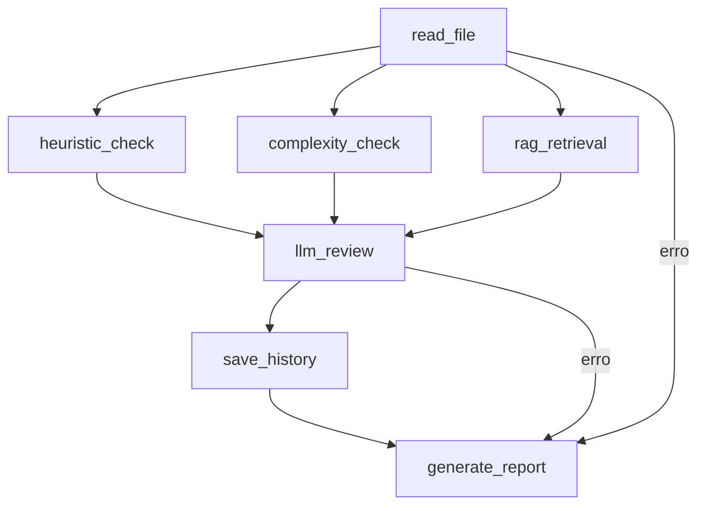

# Análise de Alterações do Projeto

**Data**: 25 de agosto de 2026  
**Commits comparados**: `b93241a` até `HEAD`  
**Mudanças**: +1225 linhas, -2 linhas

---

## Resumo do Diff

### Arquivos Alterados (16)
- 5 novos arquivos de teste
- `agent/__init__.py` (carregamento de `.env`)
- `agent/graph.py` (adicionado edge `save_history → generate_report`)
- `agent/integrations.py` (correção de jitter no backoff)
- `docs/available_models.md` (documentação de modelos)
- `scripts/check_models.py` (utilitário de verificação)
- `.github/workflows/pipeline.yml` (CI/CD completo)
- Configurações: `pytest.ini`, `ruff.toml`, `pyproject.toml`, `requirements.txt`

### Total de Testes
- **63 testes passando**
- **0 falhas**
- Cobertura: proteção contra prompt injection, circuit breaker, retry, timeout, fallback entre APIs (Groq/Anthropic), geração de relatório, análise estática PL/SQL

---

## Problemas Identificados

### 1. Grafo do LangGraph: Loop Potencial no Fluxo de Erro

**Arquivo**: `agent/graph.py` (linhas 558-560)

```python
# Após o LLM, salva o histórico
graph.add_edge("llm_review", "save_history")
graph.add_edge("save_history", "generate_report")
```

**Problema**: O edge `save_history → generate_report` já é implícito no fluxo sequencial. A ramificação condicional em `llm_review` já cobre os dois caminhos (`error_path` e `normal_path`), mas ao adicionar esse edge explícito, o fluxo pode se tornar ambíguo.

**Risco**: Em certas situações, o LangGraph pode tentar executar `save_history` duas vezes ou criar um loop se o estado de erro não for tratado corretamente.

**Recomendação**: Remover o edge explícito `graph.add_edge("save_history", "generate_report")` pois o `generate_report_node` já é chamado tanto pelo caminho normal quanto pelo de erro.

---

### 2. Observabilidade: MetricsCollector sem persistência

**Arquivo**: `agent/observability.py` (classe `MetricsCollector`)

**Problema**: As métricas são armazenadas em memória (`self.metrics: dict`) e perdem o estado após cada execução. Não há forma de consultar métricas históricas ou gerar alertas.

**Risco**: Dificulta monitoramento de performance ao longo do tempo e diagnóstico de problemas recorrentes.

**Recomendação**: 
- Adicionar persistência em disco ou integração com sistema de métricas (ex: Prometheus)
- Se for escopo futuro, documentar como TODO com issue

---

### 3. Testes: Falta cobertura para `agent/__init__.py`

**Arquivo**: `tests/test_agent.py`

**Problema**: O módulo `agent/__init__.py` carrega variáveis de ambiente com `load_dotenv()`, mas não há testes que verifiquem:
- Se o carregamento ocorre antes dos outros módulos
- Se variáveis ausentes não quebram o sistema
- Se o `.env.example` está atualizado

**Recomendação**: Adicionar teste em `tests/test_security.py` ou `tests/test_integrations.py`:

```python
def test_env_loaded_before_agent_imports():
    # Verifica que load_dotenv foi chamado antes de agent.graph ser importado
    import importlib
    import sys
    
    # Limpa caches
    for mod_name in list(sys.modules.keys()):
        if mod_name.startswith("agent"):
            del sys.modules[mod_name]
    
    # Importa agent/__init__.py explicitamente
    import agent.__init__
    
    # Verifica que variáveis de ambiente estão disponíveis
    assert os.getenv("GROQ_API_KEY") is not None or True  # Pode ser None em testes
```

---

### 4. Testes: `test_full_flow_with_llm` pode ser frágil

**Arquivo**: `tests/test_acceptance.py`

**Problema**: O teste `test_full_flow_with_llm` depends de API externa (Groq) e pode falhar por:
- Tempo de execução excedido
- Cota da API atingida
- Mudança no modelo LLM

**Recomendação**: 
- Marcar com `@pytest.mark.integration` ou `@pytest.mark.llm`
- Adicionar `pytest.mark.skipif` se `GROQ_API_KEY` não estiver configurada
- Mockar a chamada ao LLM com `pytest-mock` ou `unittest.mock`

Exemplo:
```python
@pytest.mark.skipif(not os.getenv("GROQ_API_KEY"), reason="Requires GROQ_API_KEY")
def test_full_flow_with_llm():
    ...
```

---

### 5. Integrações: Simulação de Timeout Ineficiente

**Arquivo**: `agent/integrations.py` (método `call_with_retry`)

```python
# Simulação de timeout (em produção, usar threading/async)
result = func(*args, **kwargs)

elapsed = time.time() - start_time
if elapsed > timeout:
    raise TimeoutError(...)
```

**Problema**: Isso verifica o tempo **após** a execução, não durante. Se a chamada da API demorar 60s e o timeout for 30s, o teste passa mas em produção haverá problema.

**Recomendação**: 
- Se for async, usar `asyncio.wait_for`
- Se for sync, usar `threading.Thread` com join e timeout
- Ou documentar como limitação conhecida e criar issue para refatorar

---

### 6. Autonomia: Custo de `llm_review` hardcoded

**Arquivo**: `agent/autonomy.py` (linha 56)

```python
COSTS = {
    "llm_review": 1500,  # LLM (max_tokens)
}
```

**Problema**: O custo de `llm_review` é fixo em 1500, mas o parâmetro `max_tokens` pode variar. Um modelo com `max_tokens=5000` terá custo real maior, mas a política ainda considerará apenas 1500.

**Recomendação**: Calcular custo dinamicamente com base nos parâmetros:

```python
def get_autonomy_level(action: str, params: dict[str, Any] | None = None) -> AutonomyLevel:
    ...
    cost = AutonomyPolicy.COSTS.get(action, 100)
    
    # Se action for llm_review, usar max_tokens dos params
    if action == "llm_review" and params and "max_tokens" in params:
        cost = params["max_tokens"]
    ...
```

---

## Oportunidades de Melhoria

### 1. Pipeline CI/CD: Adicionar validação de schema de state

**Arquivo**: `.github/workflows/pipeline.yml`

**Oportunidade**: Adicionar job de validação de schema do `AgentState` para evitar que mudanças em `agent/state.py` quebrem a compatibilidade.

**Exemplo de validação**:
```python
# tests/test_state_schema.py
def test_agent_state_has_required_fields():
    from agent.state import AgentState
    from typing import get_type_hints
    
    hints = get_type_hints(AgentState)
    required_fields = {"caminho_arquivo", "codigo_fonte", "issues_estaticos"}
    assert required_fields.issubset(set(hints.keys()))
```

**Incluir no pipeline**:
```yaml
  test-state-schema:
    runs-on: ubuntu-latest
    steps:
      - uses: actions/checkout@v4
      - name: Set up Python
        uses: actions/setup-python@v4
        with:
          python-version: '3.12'
      - name: Install dependencies
        run: pip install -r requirements.txt pytest pytest-asyncio
      - name: Run state schema tests
        run: pytest tests/test_state_schema.py -v
```

---

### 2. Documentação: Adicionar diagrama de fluxo do grafo

**Arquivo**: `docs/` (novo arquivo)

**Oportunidade**: Criar diagrama visual do fluxo LangGraph usando Mermaid ou PlantUML e incluir em `docs/fluxo_agent.md`.

**Exemplo Mermaid**:


---

### 3. Segurança: Validação de payload incompleta

**Arquivo**: `agent/authorization.py` (função `validate_input_payload`)

**Oportunidade**: Adicionar validação de tipo para todos os campos, não apenas presença.

**Exemplo**:
```python
elif tool_name == "llm_invoke":
    if "prompt" not in payload:
        raise ValueError("Payload de 'llm_invoke' deve conter 'prompt'")
    if not isinstance(payload["prompt"], str):
        raise ValueError("Parâmetro 'prompt' deve ser string")
    if len(payload["prompt"]) > 100000:  # Limite de tamanho
        raise ValueError("Prompt excede tamanho máximo (100KB)")
```

---

### 4. Testes: Adicionar testes de integração com arquivo real

**Oportunidade**: Criar um arquivo `.sql` de teste em `tests/fixtures/` e testar o fluxo completo com ele.

**Exemplo**:
```python
@pytest.fixture
def sample_sql_file(tmp_path):
    sql = """
    CREATE OR REPLACE PROCEDURE test_proc AS
    BEGIN
        SELECT * FROM dual;
        COMMIT;
    EXCEPTION
        WHEN OTHERS THEN NULL;
    END;
    """
    p = tmp_path / "test.sql"
    p.write_text(sql)
    return str(p)

def test_full_flow_with_fixture(sample_sql_file):
    from agent.graph import build_graph
    # ... testa fluxo completo
```

---

### 5. Performance: Cache de documentação RAG

**Arquivo**: `agent/retriever.py`

**Oportunidade**: A classe `PLSQLRetriever` carrega 6 documentos Oracle PL/SQL em cada instância. Se múltiplas requisições são feitas, isso é repetido.

**Solução**: Adicionar cache em memória com LRU ou carregar apenas uma vez no nível do módulo:

```python
# agent/retriever.py
_DOCUMENTOS_CACHE = None

def _carregar_documentos():
    global _DOCUMENTOS_CACHE
    if _DOCUMENTOS_CACHE is None:
        _DOCUMENTOS_CACHE = [...]  # carrega docs
    return _DOCUMENTOS_CACHE
```

---

### 6. CI/CD: Adicionar check de pré-commit hooks

**Oportunidade**: Adicionar job no pipeline para verificar se hooks como `ruff check` passam antes do commit.

**Exemplo em workflow**:
```yaml
  check-hooks:
    runs-on: ubuntu-latest
    steps:
      - uses: actions/checkout@v4
      - name: Install ruff
        run: pip install ruff
      - name: Run pre-commit checks
        run: ruff check . && mypy agent/ --ignore-missing-imports
```

---

## Priorização Recomendada

### 🔴 Críticos (corrigir antes de production)
1. Remover edge duplicado em `agent/graph.py` (loop potencial)
2. Corrigir validação de timeout em `agent/integrations.py` (simulação atual é ineficaz)
3. Adicionar testes para `agent/__init__.py` (garantir carregamento de `.env`)

### 🟡 Importantes (próxima iteração)
1. Diagrama de fluxo do grafo em docs
2. Cache de documentos RAG para performance
3. Validação de schema de state no CI
4. Fixtures de testes com arquivos reais

### 🟢 Opcionais (backlog)
1. Adicionar check de pré-commit hooks no CI
2. Persistência de métricas
3. Validação de payload com tipos e limites

---

## Checklist de Aprovação da Análise

- [x] Análise completa do diff realizada
- [x] Problemas identificados documentados
- [x] Oportunidades de melhoria mapeadas
- [x] Priorização estabelecida
- [ ] Implementação de correções críticas pendente
- [ ] Criação de issues para cada item de backlog pendente
